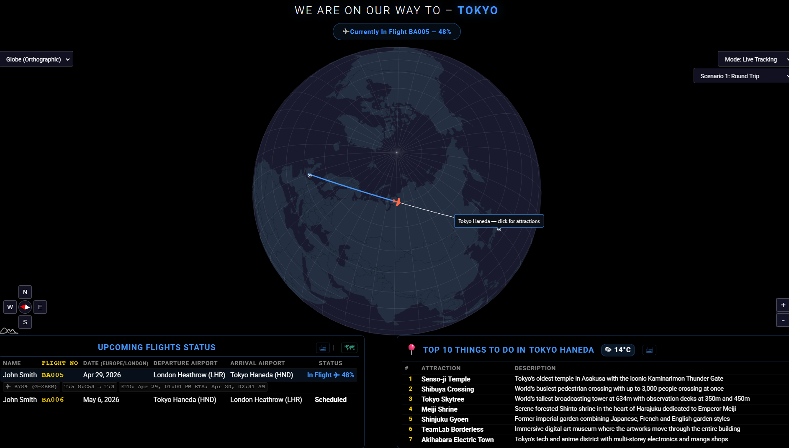
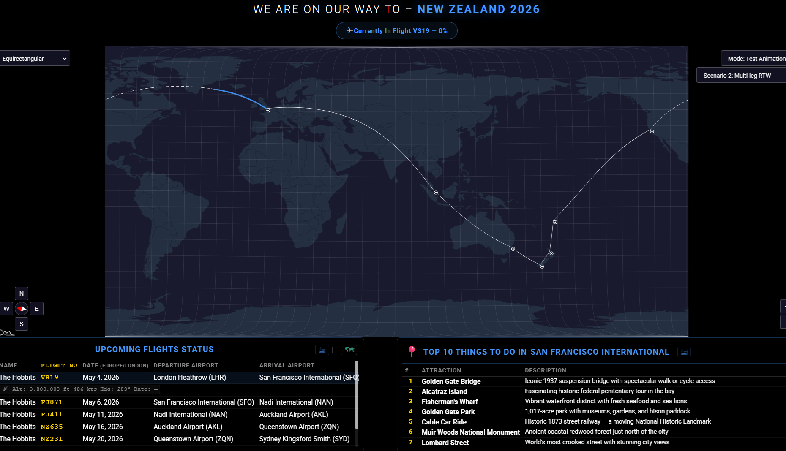
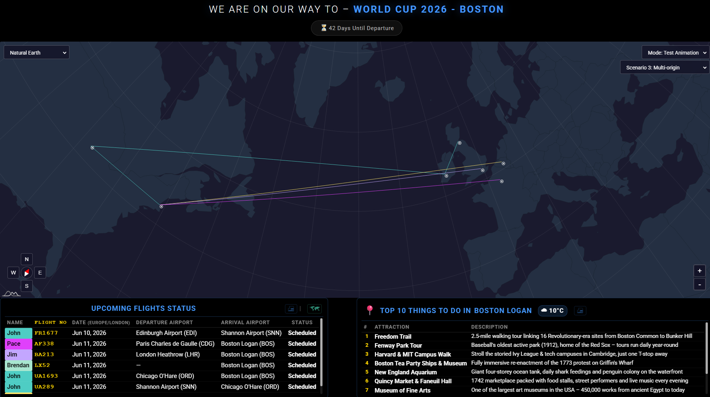
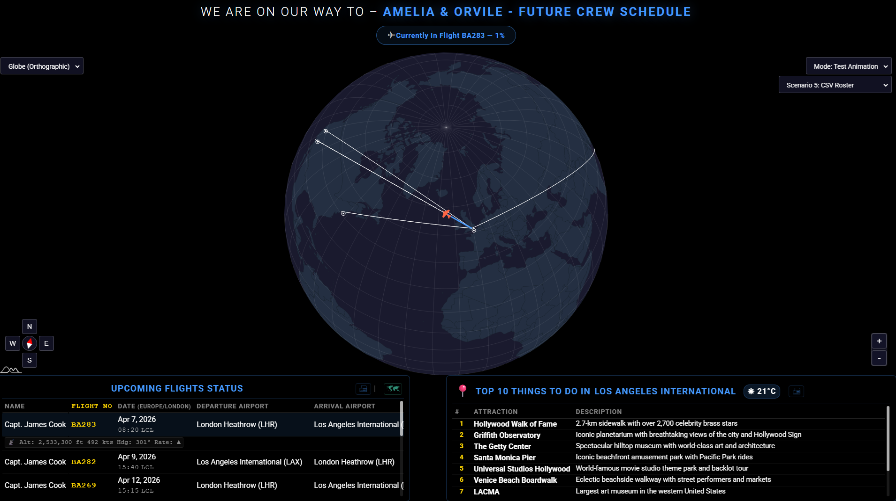
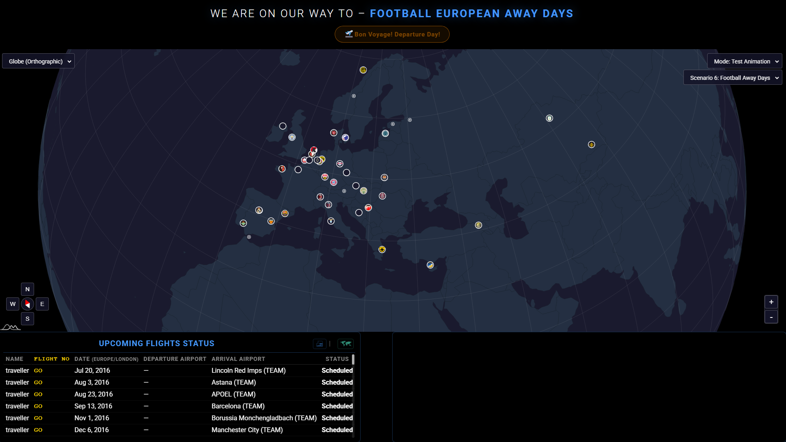

# MMM-iAmGoingThere

> A MagicMirror² module for  visulising past or upcoming trips, When used with a fre Aero API you can hssve live flight status and tracking.
> The module covers 6 distinct scenarios as detiled below  and you can choose from any one of 5 maap projections to visulise your trips.
> The module includes  colour-coded great-circle paths, countdown timer, and city attraction guides as well as printable flight itenaries and terminal guides. 
> Forked from [MMM-iHaveBeenThere](https://github.com/basti0001/MMM-iHaveBeenThere) by Sebastian Merkel.

## 🎬 Screenshots

|                                                  |                                                  |                                                  |
| :----------------------------------------------: | :----------------------------------------------: | :----------------------------------------------: |
|  |  |  |
|  |  |  |


---

## 🆕 Recent Updates (v2.0.0 — 2026-04-29)

### v2.0.0 — Graticule, Region Layers & Visited Countries
- **Graticule Grid** — Added a configurable latitude/longitude grid (`showGraticule`) with custom step, color, and opacity.
- **Scenario 4: Visited Country Coloring** — In Scenario 4 ("Where I Have Been"), countries that have been visited at least once are now automatically colored green.
- **Persistent Manual Coloring** — Right-click any country on the map to toggle its color; selections are saved to `data/manual_visited_countries.json`.
- **Sub-national Region Layers** — Layered support for US states, Canadian provinces, and sub-national regions for over 80 countries. Includes hover effects and click-to-select behavior.
- **Globe Auto-Rotation** — New `autoRotateGlobeToPlane` option to keep the plane icon centered and visible on Orthographic maps as the flight progresses.
- **Dynamic Attractions** — The attractions panel now automatically updates to the destination city when a flight is active (live or test mode) and features an origin-fallback for return legs.
- **Ocean vs. Background Colors** — Separated `colorMapBackground` (area outside the projection) from `colorMapOcean` (the water inside the map) for better visual depth.
- **Configurable Graticule Width** — New `graticuleWidth` option for fine-tuning grid line thickness.


See [CHANGELOG.md](./CHANGELOG.md) for complete details of all changes.

---


## ✨ Key Features

- **Six trip scenarios** — Standard, Multi-leg, Group, History, CSV Roster, and Football Away Days.
- **Graticule Grid & Region Layers** — Subtle lat/lon lines and sub-national map layers (States, Provinces, Departments) for 80+ countries.
- **Globe Auto-Rotation** — Automatically rotate the globe to keep active planes in view (`autoRotateGlobeToPlane`).
- **Live flight tracking** via [FlightAware AeroAPI](https://flightaware.com/aeroapi/).
- **Colour-coded great-circle paths** — Smoothly interpolated arcs with progress filling.
- **Scenario 4 Green Countries** — Automatically color visited countries green in travel history mode.
- **Manual Mapping** — Right-click any country to manually toggle its "visited" color (saves to persistent cache).
- **Dynamic Attractions** — Top 10 attractions automatically update to the destination of active/test flights or clicked markers (with origin fallback).
- **Rich live status** — Gate/terminal, taxiing, diverted labels, and Foresight ETA⚡.
- **Live Destination Weather** — Fetched from Open-Meteo for your arrival city.
- **Ocean/Background Separation** — Independent coloring for the map ocean and the surrounding "outer space" area.
- **Save to File** — Export flight details, city attractions, and terminal maps to offline HTML.
- **Football Team Support** — Resolve destinations via team names with official crest markers.
- **Local Map Engine** — Bundled amCharts 5 for performance and offline stability.
- **Multi-language Support** — Built-in translations for 33 locales.

---

## 🛤️ Trip Scenarios summary

- **Scenario 1**: Standard Round Trip.
- **Scenario 2**: Multi-Leg / Round The World.
- **Scenario 3**: Multi-Origin (Group Events/Weddings).
- **Scenario 4**: "Where I Have Been" (Past Travel History).
- **Scenario 5**: CSV-based Crew Roster.
- **Scenario 6**: Football Away Days (Stadium resolution via team database).

---

## 🎨 Flight Path Colours

- ⬜ **White**: Scheduled / future leg.
- 🔵 **Blue**: Currently in flight (arc fills progressively).
- 🟢 **Green**: Landed / completed.
- 🔘 **Grey**: Previous leg (superseded by a later flight).
- 🔴 **Red**: Cancelled.

---

## 🚀 Quick Start

### Installation
```js
1. `cd ~/MagicMirror/modules/`
2. `git clone https://github.com/gitgitaway/MMM-MyTeams-iAmGoingThere.git`
3. `cd MMM-MyTeams-iAmGoingThere && npm install`
```
### Basic Configuration (Scenario 1) 
```js
{
  module: "MMM-iAmGoingThere",
  position: "fullscreen_below",
  config: {
    scenario: 1,
    tripTitle: "Barcelona Summer 2026",
    flightAwareApiKey: "YOUR_API_KEY",
    home: "GLA",
    destination: "BCN",
    flights: [
      { travelerName: "Family", flightNumber: "FR2891", departureDate: "2026-08-01", from: "GLA", to: "BCN" },
      { travelerName: "Family", flightNumber: "FR2892", departureDate: "2026-08-08", from: "BCN", to: "GLA" }
    ]
  }
}
```

---

## 📚 Documentation

Detailed guides for every feature and configuration options are shown below.

| Document | Purpose |
|----------|---------|
| [User Configuration Guide](./documents/configuration_User_Guide.md) | Comprehensive guide on all 50+ config options |
| [Scenarios Guide](./documents/Scenarios.md) | Detailed examples for all 6 scenarios (RTW, Group, CSV, Football, etc.) |
| [How This Module Works](./documents/HowThisModuleWorks.md) | Internal logic, rendering pipeline, and technical overview |
| [Troubleshooting Guide](./documents/Troubleshooting.md) | API, map, and scenario-specific solutions |
| [Map Projections Guide](./documents/mapProjections-User-Guide.md) | Choosing the right projection (Mercator, Globe, etc.) |
| [Accessibility Features](./documents/Accessibility_Features.md) | ARIA roles, colorblind mode, and design principles |
| [API Rate Limit Guide](./documents/apiRateLimit_Guide.md) | AeroAPI usage and optimization |
| [Translations Guide](./documents/Translations.md) | Supported languages and locale settings |

## ⚖️ License & Credits

- MIT Licensed.
- Forked from [MMM-iHaveBeenThere](https://github.com/basti0001/MMM-iHaveBeenThere) by Sebastian Merkel.
- Maps powered by [amCharts 5](https://www.amcharts.com/).
- Flight data by [FlightAware](https://flightaware.com/).
