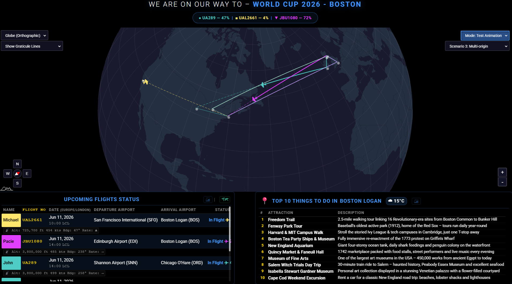
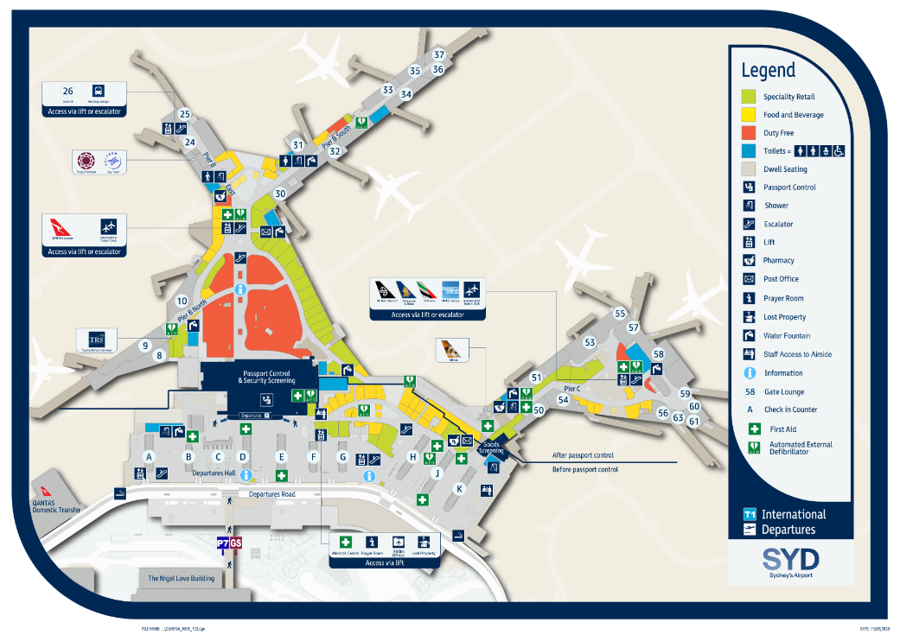
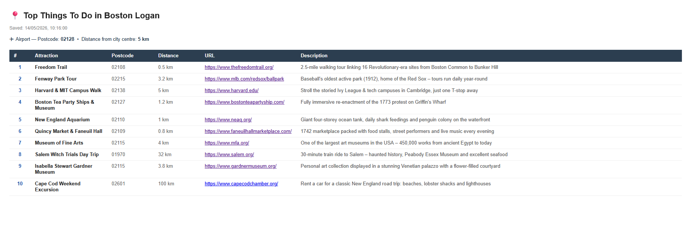

# MMM-iAmGoingThere

> A MagicMirror² module for  visulising past, present  or future trips, When used with a free Aero API you can have live flight status and tracking.
> The module covers 6 distinct scenarios as detiled below and you can choose from any one of 5 map projections to visulise your trips.
> The module includes  colour-coded great-circle paths, countdown timer, and city attraction guides as well as printable flight itenaries and terminal guides.
> Forked from [MMM-iHaveBeenThere](https://github.com/basti0001/MMM-iHaveBeenThere) by Sebastian Merkel.

---

## Screenshots

| | |  |
|---|---|---|
|  |  | |
|  |  | |
|  |  | |
|  |  | |

---

## 🆕 Recent Updates

## v2.3.3 UEFA Competitions Attractions Expansion (2026-05-18)
- **UEFA 2010–2025 Expansion** — 78 new attraction files covering every city that fielded a team in the UEFA Champions League, Europa League or Europa Conference League between 2010–11 and 2024–25, where a file was not already present.
- **Phase 1 (2023–25 seasons):** 45 new files across Belgium, France, Germany, Italy, Spain, Netherlands, Portugal, Austria, Switzerland, Monaco, Czech Republic, Norway, Sweden, Denmark, Poland, Slovenia, Bosnia, Serbia, Slovakia, Cyprus, Bulgaria, Moldova, Faroe Islands and Wales.
- **Phase 2 (2010–23 seasons):** 33 new files including Leicester, Wolverhampton (England); Vigo, Granada, Pamplona, A Coruña (Spain); Bremen, Wolfsburg, Mönchengladbach, Augsburg, Mainz (Germany); Udine, Reggio Emilia (Italy); Saint-Étienne, Reims (France); Arnhem, Utrecht (Netherlands); Liège (Belgium); Maribor, Osijek, Östersund, Odense, Cluj-Napoca, Borisov, Kazan, Krasnodar, Trabzon, Haifa, Beer Sheva, Jerusalem, Dnipro and more.
- **UEFA Reference Document** — New `documents/uefaLeagueCompetitionParticipants.md` listing all UCL/UEL/UECL group-phase participants from 2010–25 with their city JSON file. Total attractions coverage is now **544 cities**.

## v2.3.2 Scotland & Ireland City Expansion (2026-05-17)
- **Scotland Expansion** — 17 new attraction files for Scottish cities/towns with population > 25,000: Dundee, Inverness, Perth, Stirling, Paisley, East Kilbride, Livingston, Hamilton, Dunfermline, Cumbernauld, Kirkcaldy, Greenock, Falkirk, Glenrothes, Airdrie, Motherwell, Dumfries.
- **Ireland Expansion** — 7 new attraction files for Irish cities/towns with population > 25,000: Galway, Waterford, Drogheda, Dundalk, Bray, Navan, Kilkenny. Total attractions coverage is now **466 cities**.

## v2.3.1 Attractions Data Completion & Shannon Added (2026-05-17)
- **Full Attractions Data** — All 441 city attraction files now have every field populated (`rank`, `name`, `postcode`, `distanceKmFromAirport`, `description`, `distance`, `URL`). Previously 435 files had missing or null values.
- **Shannon (SNN) Added** — New attractions file for Shannon, County Clare, Ireland, covering Bunratty Castle, Cliffs of Moher, The Burren, King John's Castle and more.

## v2.3.0 Timezone Fixes, Panel Clocks & Visual Refinements (2026-05-12)
- **International Date Line & Timezone Fix (TZ-001)** — Flight status now computed entirely in UTC using longitude-based airport offsets. Flights near or across the International Date Line (e.g. Fiji → Auckland) now show correctly for viewers in any timezone.
- **Destination City Clock (Flight Panel)** — The flight data panel title bar shows the local time at the traveller's current destination, with GMT offset in smaller italic (`HH:MM DD/Mon/YY (GMT+x)`).
- **Attractions Clock Repositioned** — Moved from the right side to the left of the attractions panel header and restyled to match the flight panel clock (smaller, italic).
- **`attractionsClockMode` Config Option** — Choose `"home"` (viewer's local time, default) or `"zulu"` (UTC with `(Z)` suffix) for the attractions panel clock.
- **Attractions Always Tracks Traveller's Location** — The attractions panel now always shows the last-landed destination city regardless of the `autoRotateAttractionsData` setting, and always rotates through in-flight destinations when multiple flights are active.
- **Smaller Plane Icon** — Default aircraft marker size reduced by 30% for a cleaner map appearance.

## v2.2.0 Phase 4: UX & Innovation (2026-05-07)
- **Zen Mode (UIX-001)** — Added an intelligent auto-hide feature that fades out all UI overlays and controls after a period of inactivity, keeping the map clean and focused.
- **Color Blind Mode (UIX-002)** — Integrated an IBM-designed 10-color safe palette for travelers and updated status table colors for improved accessibility.
- **Interactive Fly-to (UIX-003)** — Table rows are now interactive; clicking a flight zooms and pans the map directly to that leg's path.
- **AI Fun Facts (INN-001)** — Optional integration with OpenAI-compatible APIs to show interesting trivia about your destination.
- **Calendar-Driven Scenarios (INN-002)** — Automatically switch module scenarios based on keywords in your MagicMirror calendar events.

## v2.1.0 Phase 3: Performance & Caching (2026-05-06)
- **Disk-persistent Weather Cache (CCH-001)** — Weather data is now saved to disk, significantly reducing API calls after restarts.
- **Low Power Mode (PER-002)** — Optimized for Raspberry Pi Zero/older hardware by disabling heavy CSS effects and reducing path vertex density.
- **Lazy Asset Loading (PER-003)** — Large databases (like football teams) are now loaded only when the specific scenario is active.

## v2.1.0 Phase 1 & 2: Security, Accessibility & Refactoring (2026-05-05)
- **Service-Oriented Architecture (STR-001)** — Major backend refactoring with dedicated services for FlightAware, Weather, and FileSystem.
- **Monolithic Reduction (PER-001)** — Core files split into functional modules (`FlightProcessor.js`, `StateController.js`) for better maintainability.
- **API Key Security (SEC-001)** — Support for `FLIGHTAWARE_API_KEY` environment variables.
- **Enhanced Accessibility (ACC-001/002)** — Full keyboard navigation and ARIA landmark support.

## Directional Nudge Control & UI Auto-Hide (2026-05-04)
- **Directional Nudge Control** — Added a 4-way arrow control (`showNudgeControl`) to fine-tune the map's screen position relative to the home location without altering the projection rotation.
- **Auto-Hide UI Controls** — New `hideControlsUntilHover` option to hide all on-screen controls until mouse hover for a cleaner "map-only" look.
- **Polar Ice Cap Suppression** — New `hideIceCaps` option to hide Antarctica on all map projections except the Globe.
- **Improved Plane Alignment** — Aircraft nose now accurately follows the great-circle path curvature across all projections.

## v2.0.0 Visited Countries — Improved Marking & Control (2026-05-02)
- **Right-click Confirmation Popup** — Right-clicking a country now shows a popup with the country name, its current visited status, and **"Mark as Visited"** / **"Remove Visited"** / **"Cancel"** buttons (auto-dismisses after 5 s).
- **Works in All Scenarios** — Manual country marking via right-click is available in every scenario, not just Scenario 4.
- **Highlights Control Dropdown** — A new dropdown below the Map Projection selector provides **"Highlight Visited Countries"** (default), **"No Highlights"** (suppress display without deleting data), and **"Clear Manually Marked Cache"** (wipe `manual_visited_countries.json`).
- **Highlight State Persists** — Selecting "No Highlights" suppresses all country highlights until you manually re-select "Highlight Visited Countries" or restart the module.
- **Translated Popup** — Popup text routes through the translation system and is available in all 33 supported languages.


See [CHANGELOG.md](./CHANGELOG.md) for complete details of all changes.

---


## ✨ Key Features

- **Zen Mode & Auto-Hide** — Intelligent UI management that fades out overlays during inactivity for a focused map-only experience.
- **Interactive Map Navigation** — Click flight table rows to "Fly-to" specific legs; manual pan, zoom, and nudge controls with magnetic compass.
- **AI Destination Insights** — Integrated LLM support for single-sentence destination trivia and "Fun Facts".
- **Calendar Integration** — Automatically switch scenarios based on upcoming MagicMirror calendar events.
- **Accessibility First** — Color-blind safe palettes, full keyboard navigation, and ARIA landmarks.
- **High Performance** — Disk-persistent caching, service-oriented backend, and low-power optimizations for Raspberry Pi hardware.
- **Six trip scenarios** — Standard, Multi-leg, Group, History, CSV Roster, and Football Away Days.
- **Football Team Support** — Resolve destinations via team names with official crest markers.
- **Local Map Engine** — Bundled amCharts 5 for performance and offline stability.
- **Multi-language Support** — Built-in translations for 33 locales.

---

## 🛤️ Trip Scenarios summary

- **Scenario 1**: Standard Round Trip.
- **Scenario 2**: Multi-Leg / Round The World.
- **Scenario 3**: Multi-Origin (Group Events/Weddings).
- **Scenario 4**: "Where I Have Been" (Past Travel History).
- **Scenario 5**: CSV-based Crew Roster.
- **Scenario 6**: Football Away Days (Stadium resolution via team database).

---

## 🎨 Flight Path Colours

- ⬜ **White**: Scheduled / future leg.
- 🔵 **Blue**: Currently in flight (arc fills progressively).
- 🟢 **Green**: Landed / completed.
- 🔘 **Grey**: Previous leg (superseded by a later flight).
- 🔴 **Red**: Cancelled.

---

## 🚀 Quick Start

## Installation

1. Navigate to your MagicMirror's modules folder:

```bash
cd ~/MagicMirror/modules/
```

2. Clone this repository:

```bash
git clone https://github.com/gitgitaway/MMM-iAmGoingThere.git
```

3. Install dependencies:
```bash
cd modules/MMM-iAmGoingThere
npm install
```

## Update

```bash
cd ~/MagicMirror/modules/MMM-iAmGoingThere
git pull
```

### Basic Configuration (Scenario 1) 
```js
{
  module: "MMM-iAmGoingThere",
  position: "fullscreen_below",
  config: {
    scenario: 1,
    tripTitle: "Barcelona Summer 2026",
    flightAwareApiKey: "YOUR_API_KEY", // Or set FLIGHTAWARE_API_KEY environment variable (Recommended)
    home: "GLA",
    destination: "BCN",
    flights: [
      { travelerName: "Family", flightNumber: "FR2891", departureDate: "2026-08-01", from: "GLA", to: "BCN" },
      { travelerName: "Family", flightNumber: "FR2892", departureDate: "2026-08-08", from: "BCN", to: "GLA" }
    ]
  }
}
```

---

## 📚 Documentation

Detailed guides for every feature and configuration options are shown below.

| Document | Purpose |
|----------|---------|
| [User Configuration Guide](./documents/configuration_User_Guide.md) | Comprehensive guide on all 50+ config options |
| [Scenarios Guide](./documents/Scenarios.md) | Detailed examples for all 6 scenarios (RTW, Group, CSV, Football, etc.) |
| [How This Module Works](./documents/HowThisModuleWorks.md) | Internal logic, rendering pipeline, and technical overview |
| [Troubleshooting Guide](./documents/Troubleshooting.md) | API, map, and scenario-specific solutions |
| [Map Projections Guide](./documents/mapProjections-User-Guide.md) | Choosing the right projection (Mercator, Globe, etc.) |
| [Accessibility Features](./documents/Accessibility_Features.md) | ARIA roles, colorblind mode, and design principles |
| [API Rate Limit Guide](./documents/apiRateLimit_Guide.md) | AeroAPI usage and optimization |
| [Translations Guide](./documents/Translations.md) | Supported languages and locale settings |
| [Mark Country As Visited Guide](./documents/Mark_Country_As_Visited_Guide.md) | Right-click popup, highlights control, and manual cache management |
| [UEFA Competition Participants](./documents/uefaLeagueCompetitionParticipants.md) | All UCL/UEL/UECL group-phase clubs 2010–2025 with city JSON file reference |

## ⚖️ License & Credits

- MIT Licensed.
- Forked from [MMM-iHaveBeenThere](https://github.com/basti0001/MMM-iHaveBeenThere) by Sebastian Merkel.
- Maps powered by [amCharts 5](https://www.amcharts.com/).
- Flight data by [FlightAware](https://flightaware.com/).
