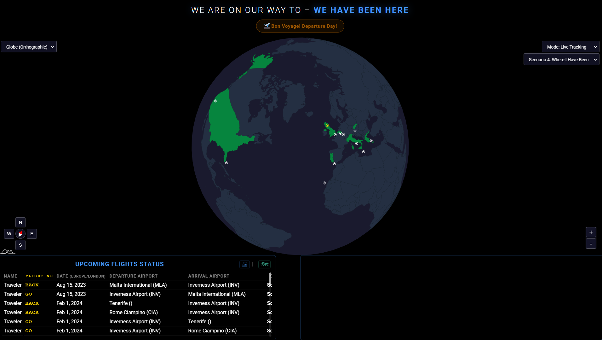
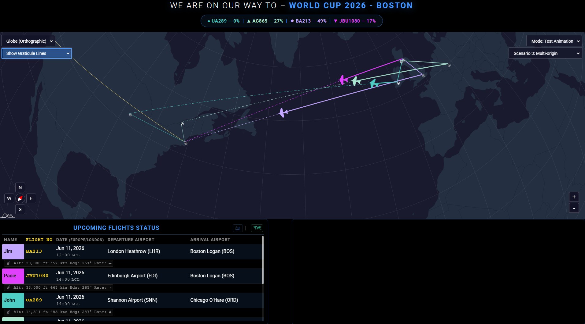

# MMM-iAmGoingThere

> A MagicMirror² module for  visulising past, present  or future trips, When used with a fre Aero API you can hssve live flight status and tracking.
> The module covers 6 distinct scenarios as detiled below and you can choose from any one of 5 map projections to visulise your trips.
> The module includes  colour-coded great-circle paths, countdown timer, and city attraction guides as well as printable flight itenaries and terminal guides.
> Forked from [MMM-iHaveBeenThere](https://github.com/basti0001/MMM-iHaveBeenThere) by Sebastian Merkel.

---

## Screenshots

| | |  |
|---|---|---|
|  |  | |
|  |  | |
|  |  | |

---

## 🆕 Recent Updates

## Directional Nudge Control & UI Auto-Hide (2026-05-04)
- **Directional Nudge Control** — Added a 4-way arrow control (`showNudgeControl`) to fine-tune the map's screen position relative to the home location without altering the projection rotation.
- **Auto-Hide UI Controls** — New `hideControlsUntilHover` option to hide all on-screen controls until mouse hover for a cleaner "map-only" look.
- **Polar Ice Cap Suppression** — New `hideIceCaps` option to hide Antarctica on all map projections except the Globe.
- **Improved Plane Alignment** — Aircraft nose now accurately follows the great-circle path curvature across all projections.

## v2.0.0 Visited Countries — Improved Marking & Control (2026-05-02)
- **Right-click Confirmation Popup** — Right-clicking a country now shows a popup with the country name, its current visited status, and **"Mark as Visited"** / **"Remove Visited"** / **"Cancel"** buttons (auto-dismisses after 5 s).
- **Works in All Scenarios** — Manual country marking via right-click is available in every scenario, not just Scenario 4.
- **Highlights Control Dropdown** — A new dropdown below the Map Projection selector provides **"Highlight Visited Countries"** (default), **"No Highlights"** (suppress display without deleting data), and **"Clear Manually Marked Cache"** (wipe `manual_visited_countries.json`).
- **Highlight State Persists** — Selecting "No Highlights" suppresses all country highlights until you manually re-select "Highlight Visited Countries" or restart the module.
- **Translated Popup** — Popup text routes through the translation system and is available in all 33 supported languages.


See [CHANGELOG.md](./CHANGELOG.md) for complete details of all changes.

---


## ✨ Key Features

- **Six trip scenarios** — Standard, Multi-leg, Group, History, CSV Roster, and Football Away Days.
- **Graticule Grid & Region Layers** — Subtle lat/lon lines and sub-national map layers (States, Provinces, Departments) for 80+ countries.
- **Globe Auto-Rotation** — Automatically rotate the globe to keep active planes in view (`autoRotateGlobeToPlane`).
- **Live flight tracking** via [FlightAware AeroAPI](https://flightaware.com/aeroapi/).
- **Colour-coded great-circle paths** — Smoothly interpolated arcs with progress filling.
- **Visited Country Highlights** — Automatically colour visited countries in Scenario 4; manually mark any country in any scenario via right-click popup.
- **Highlights Control** — Dropdown to toggle graticule grid lines, visited highlights on/off, or clear the manual cache without restarting.
- **Improved UI Selectors** — Independent on-screen dropdown controls for Projection, Visited Highlights, Scenario, and Mode selectors.
- **Dynamic Attractions** — Top 10 attractions automatically update to the destination of active/test flights or clicked markers (with origin fallback).
- **Rich live status** — Gate/terminal, taxiing, diverted labels, and Foresight ETA⚡.
- **Live Destination Weather** — Fetched from Open-Meteo for your arrival city.
- **Ocean/Background Separation** — Independent coloring for the map ocean and the surrounding "outer space" area.
- **Save to File** — Export flight details, city attractions, and terminal maps to offline HTML.
- **Football Team Support** — Resolve destinations via team names with official crest markers.
- **Local Map Engine** — Bundled amCharts 5 for performance and offline stability.
- **Multi-language Support** — Built-in translations for 33 locales.

---

## 🛤️ Trip Scenarios summary

- **Scenario 1**: Standard Round Trip.
- **Scenario 2**: Multi-Leg / Round The World.
- **Scenario 3**: Multi-Origin (Group Events/Weddings).
- **Scenario 4**: "Where I Have Been" (Past Travel History).
- **Scenario 5**: CSV-based Crew Roster.
- **Scenario 6**: Football Away Days (Stadium resolution via team database).

---

## 🎨 Flight Path Colours

- ⬜ **White**: Scheduled / future leg.
- 🔵 **Blue**: Currently in flight (arc fills progressively).
- 🟢 **Green**: Landed / completed.
- 🔘 **Grey**: Previous leg (superseded by a later flight).
- 🔴 **Red**: Cancelled.

---

## 🚀 Quick Start

## Installation

1. Navigate to your MagicMirror's modules folder:

```bash
cd ~/MagicMirror/modules/
```

2. Clone this repository:

```bash
git clone https://github.com/gitgitaway/MMM-iAmGoingThere.git
```

3. Install dependencies:
```bash
cd modules/MMM-iAmGoingThere
npm install
```

## Update

```bash
cd ~/MagicMirror/modules/MMM-iAmGoingThere
git pull
```

### Basic Configuration (Scenario 1) 
```js
{
  module: "MMM-iAmGoingThere",
  position: "fullscreen_below",
  config: {
    scenario: 1,
    tripTitle: "Barcelona Summer 2026",
    flightAwareApiKey: "YOUR_API_KEY",
    home: "GLA",
    destination: "BCN",
    flights: [
      { travelerName: "Family", flightNumber: "FR2891", departureDate: "2026-08-01", from: "GLA", to: "BCN" },
      { travelerName: "Family", flightNumber: "FR2892", departureDate: "2026-08-08", from: "BCN", to: "GLA" }
    ]
  }
}
```

---

## 📚 Documentation

Detailed guides for every feature and configuration options are shown below.

| Document | Purpose |
|----------|---------|
| [User Configuration Guide](./documents/configuration_User_Guide.md) | Comprehensive guide on all 50+ config options |
| [Scenarios Guide](./documents/Scenarios.md) | Detailed examples for all 6 scenarios (RTW, Group, CSV, Football, etc.) |
| [How This Module Works](./documents/HowThisModuleWorks.md) | Internal logic, rendering pipeline, and technical overview |
| [Troubleshooting Guide](./documents/Troubleshooting.md) | API, map, and scenario-specific solutions |
| [Map Projections Guide](./documents/mapProjections-User-Guide.md) | Choosing the right projection (Mercator, Globe, etc.) |
| [Accessibility Features](./documents/Accessibility_Features.md) | ARIA roles, colorblind mode, and design principles |
| [API Rate Limit Guide](./documents/apiRateLimit_Guide.md) | AeroAPI usage and optimization |
| [Translations Guide](./documents/Translations.md) | Supported languages and locale settings |
| [Mark Country As Visited Guide](./documents/Mark_Country_As_Visited_Guide.md) | Right-click popup, highlights control, and manual cache management |

## ⚖️ License & Credits

- MIT Licensed.
- Forked from [MMM-iHaveBeenThere](https://github.com/basti0001/MMM-iHaveBeenThere) by Sebastian Merkel.
- Maps powered by [amCharts 5](https://www.amcharts.com/).
- Flight data by [FlightAware](https://flightaware.com/).
